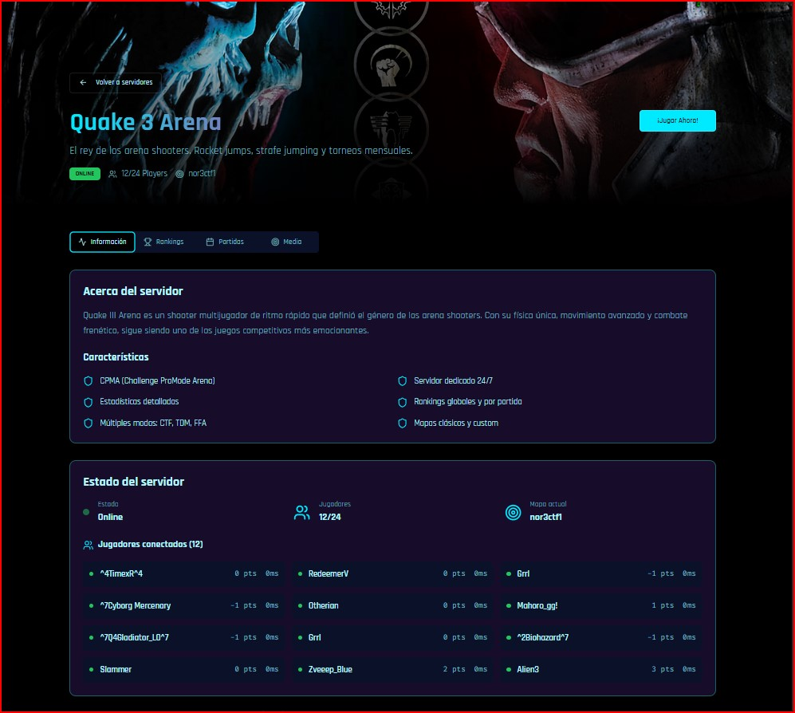
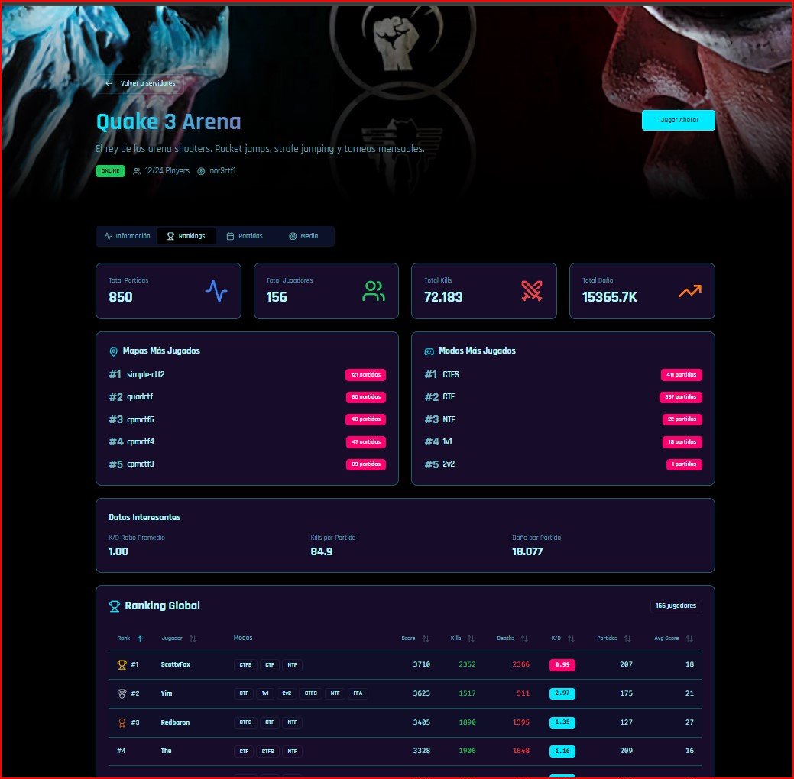
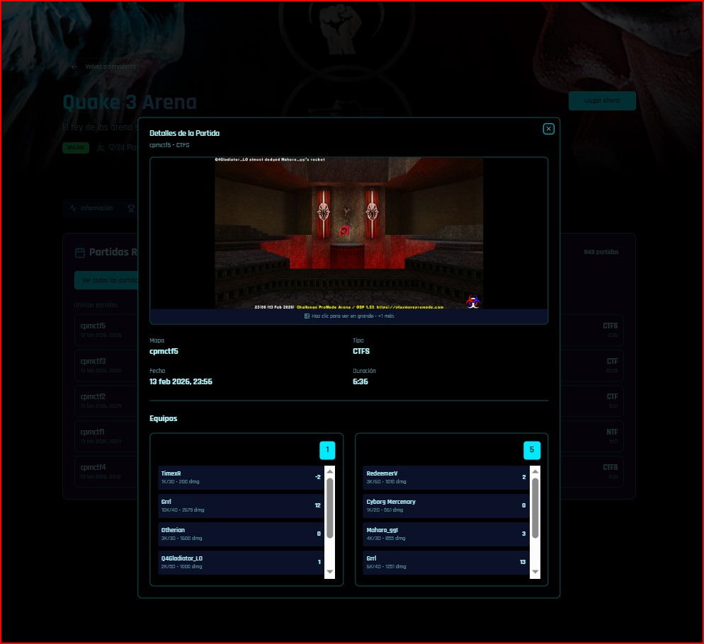
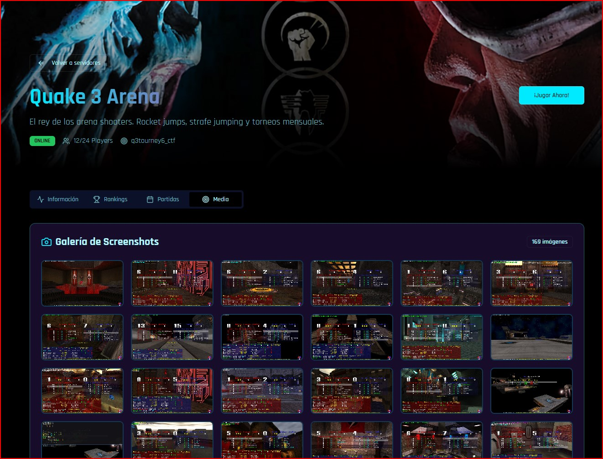

# Multi Gaming Community

Portal multijuegos con landing page, estado de servidores en tiempo real e interfaz cyberpunk.

Full funcional para Quake 3 Arena mod cpma, levanta los stats de partidas, las capturas, las correlaciona por mapa fecha hora y muestra el status de la partida actual !

**Dominio:** tu url ip o localhost
**Stack:** React + Node.js + PostgreSQL + Docker + SSL (Let's Encrypt)

## ✨ Caracteristicas

- **Portal multijuegos** con tarjetas de servidores y acceso rapido
- **Estado en tiempo real** para Quake 3 (online, mapa y jugadores)
- **Rankings, partidas recientes y estadisticas** desde CPMA
- **Galeria de capturas** asociadas por mapa
- **Diseno responsivo** y animaciones estilo cyberpunk
- **HTTPS gratis** con Certbot + Nginx + renovacion automatica

## 🖼️ Galeria

| Servidor Online | Ranking | Partidas Recientes | Galeria |
| --- | --- | --- | --- |
|  |  |  |  |

## 🛠️ Stack Tecnologico

**Frontend**
- React 18 + TypeScript
- Tailwind CSS + Shadcn UI
- Framer Motion
- Wouter

**Backend**
- Node.js + Express
- Drizzle ORM + PostgreSQL
- Quake 3 UDP getstatus (cache 30s)

**DevOps**
- Vite
- Docker
- Certbot (SSL gratis)

## ⚙️ Configuracion

### Variables de Entorno (.env)

```env
NODE_ENV=production
PORT=5001
DOMAIN= tu url ip o localhost
DATABASE_URL=postgres://postgres:postgres@db:5432/app_db
CERTBOT_EMAIL=tu-email@gmail.com

# Quake 3 / CPMA
STATS_PATH=G:\Games\Quake3\cpma\stats
SCREENSHOTS_PATH=G:\Games\Quake3\cpma\screenshots
Q3A_RCON_PASSWORD=tu-password
```

### Quake 3 Status (UDP)

- Por defecto consulta `localhost:27960`
- Cache de 30 segundos para evitar spam de UDP
- Endpoint: `GET /api/server/status`

## 🚀 Instalacion Rapida

Este proyecto puede ejecutarse tanto con **Node/npm** como con **Docker Compose**.

### Docker (Produccion)

```bash
mkdir -p certs letsencrypt acme-challenge
docker-compose up -d
```

**Requisitos:**
- Docker instalado
- Puertos 80/443 abiertos en el router
- Dominio apuntando a tu IP

**Nota sobre certificados:**
- No hace falta subir `certs/`, `letsencrypt/` ni `acme-challenge/` a GitHub.
- Los certificados se generan y se renuevan automaticamente via `docker-compose`.

### Desarrollo Local

```bash
npm install
npm run dev
```

Acceso local: http://localhost:5001

## 📁 Estructura del Proyecto

```
yim.servegame.com/
├── client/                 # React Frontend
├── server/                 # Node.js Backend
├── shared/                 # Tipos y schemas
├── docker-compose.yml
├── nginx.conf
└── README.md
```

## 📚 Documentacion

- [SETUP-CERTBOT-DOCKER.md](SETUP-CERTBOT-DOCKER.md)
- [COMO-USAR-STATS.md](COMO-USAR-STATS.md)
- [STATS-SYSTEM.md](STATS-SYSTEM.md)

## ✨ Autor

Desarrollado con amor por GitHub Copilot (Claude Sonnet 4.5 / Chat-GPT 5.2)

🤖 AI-Powered Development for the Quake 3 Community

Just coding 4 fun !!!
